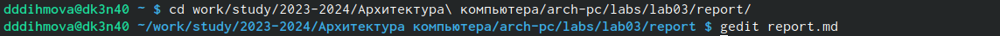
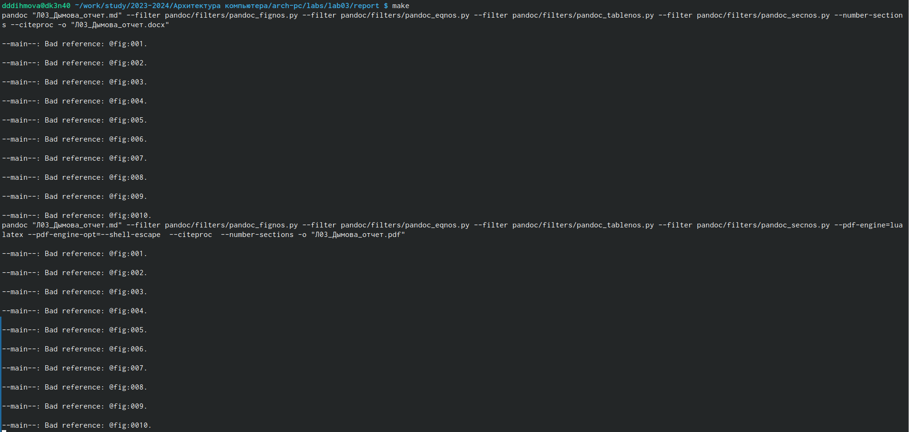

---
## Front matter
title: "Отчёт по лабораторной работа №3"
subtitle: "Дисциплина: Компьютерные науки и технологии программирования"
author: "Дымова Д.Д."

## Generic otions
lang: ru-RU
toc-title: "Содержание"

## Bibliography
bibliography: bib/cite.bib
csl: pandoc/csl/gost-r-7-0-5-2008-numeric.csl

## Pdf output format
toc: true # Table of contents
toc-depth: 2
lof: true # List of figures
lot: true # List of tables
fontsize: 12pt
linestretch: 1.5
papersize: a4
documentclass: scrreprt
## I18n polyglossia
polyglossia-lang:
  name: russian
  options:
	- spelling=modern
	- babelshorthands=true
polyglossia-otherlangs:
  name: english
## I18n babel
babel-lang: russian
babel-otherlangs: english
## Fonts
mainfont: PT Serif
romanfont: PT Serif
sansfont: PT Sans
monofont: PT Mono
mainfontoptions: Ligatures=TeX
romanfontoptions: Ligatures=TeX
sansfontoptions: Ligatures=TeX,Scale=MatchLowercase
monofontoptions: Scale=MatchLowercase,Scale=0.9
## Biblatex
biblatex: true
biblio-style: "gost-numeric"
biblatexoptions:
  - parentracker=true
  - backend=biber
  - hyperref=auto
  - language=auto
  - autolang=other*
  - citestyle=gost-numeric
## Pandoc-crossref LaTeX customization
figureTitle: "Рис."
tableTitle: "Таблица"
listingTitle: "Листинг"
lofTitle: "Список иллюстраций"
lotTitle: "Список таблиц"
lolTitle: "Листинги"
## Misc options
indent: true
header-includes:
  - \usepackage{indentfirst}
  - \usepackage{float} # keep figures where there are in the text
  - \floatplacement{figure}{H} # keep figures where there are in the text
---

# Цель работы

Целью работы является освоение процедуры оформления отчетов с помощью легковесного языка разметки Markdown.

# Теоретическое введение

Знак # используется с целью создания заголовка.
Полужирное начертание **words**. 
Курсивное начертание *words*.
Полужирное и курсивное начертание ***words***.
Стрелочку(>) используют для создания блока цитирования.
С помощью цифр можно создать упорядоченный список. Для того чтобы вложить один список в другой необходимо добавить отступ. Также с помощью звёздочки или тире можно создать неупорядоченный список.
Гиперссылки указываются в круглых скобках, а имя файла, на который даётся ссылка в квадратных.
В Markdown существует формат огражеденных блоков. Для его записи необходимо использовать верхние запятые (```).

# Выполнение лабораторной работы

Я открыла терминал, перешла в каталог arch-pc, обновила локальный репозиторий, введя git pull, перешла в каталог с шаблоном отчета по лабораторной работе №3 (рис. [-@fig:001]).

{ #fig:001 width=70% }

Провожу компиляцию шаблона (рис. [-@fig:002]).

{ #fig:002 width=70% }

Удаляю полученные файлы и проверяю, что файлы были удалены (рис. [-@fig:003]).

{ #fig:003 width=70% }

Открываю файл report.md с помощью текстового редактора (рис. [-@fig:004]).

{ #fig:004 width=70% }

Я заполнила отчет и скомпилировала его с использованием Makefile. Отчет в трех форматах предоставлен.

# Выполнение заданий для самостоятельной работы

Перехожу в каталог с отчётом по лабораторной работе и открываю файл с шаблоном отчёта (рис. [-@fig:005]).

{ #fig:005 width=70% }

Переименовала файл, в котором заполняла отчёт (рис. [-@fig:006]).

{ #fig:006 width=70% }

Переименовала отчёт по второй лабораторной работе (рис. [-@fig:007]).

{ #fig:007 width=70% }

Компилирую отчёт Markdown в docx (рис. [-@fig:008]).

{ #fig:008 width=70% }

Компилирование файла Markdown в pdf (рис. [-@fig:009]).

{ #fig:009 width=70% }

Загружаю файлы на github (рис. [-@fig:0010]).

{ #fig:0010 width=70% }

# Выводы

Я освоила процедуры оформления отчётов с помощью легковесного языка разметки Markdown.

