---
## Front matter
title: "Отчёт по лабораторной работа №4"
subtitle: "Дисциплина: Компьютерные науки и технологии программирования"
author: "Дымова Д.Д."

## Generic otions
lang: ru-RU
toc-title: "Содержание"

## Bibliography
bibliography: bib/cite.bib
csl: pandoc/csl/gost-r-7-0-5-2008-numeric.csl

## Pdf output format
toc: true # Table of contents
toc-depth: 2
lof: true # List of figures
lot: true # List of tables
fontsize: 12pt
linestretch: 1.5
papersize: a4
documentclass: scrreprt
## I18n polyglossia
polyglossia-lang:
  name: russian
  options:
	- spelling=modern
	- babelshorthands=true
polyglossia-otherlangs:
  name: english
## I18n babel
babel-lang: russian
babel-otherlangs: english
## Fonts
mainfont: PT Serif
romanfont: PT Serif
sansfont: PT Sans
monofont: PT Mono
mainfontoptions: Ligatures=TeX
romanfontoptions: Ligatures=TeX
sansfontoptions: Ligatures=TeX,Scale=MatchLowercase
monofontoptions: Scale=MatchLowercase,Scale=0.9
## Biblatex
biblatex: true
biblio-style: "gost-numeric"
biblatexoptions:
  - parentracker=true
  - backend=biber
  - hyperref=auto
  - language=auto
  - autolang=other*
  - citestyle=gost-numeric
## Pandoc-crossref LaTeX customization
figureTitle: "Рис."
tableTitle: "Таблица"
listingTitle: "Листинг"
lofTitle: "Список иллюстраций"
lotTitle: "Список таблиц"
lolTitle: "Листинги"
## Misc options
indent: true
header-includes:
  - \usepackage{indentfirst}
  - \usepackage{float} # keep figures where there are in the text
  - \floatplacement{figure}{H} # keep figures where there are in the text
---

# Цель работы

Освоение процедуры компиляции и сборки программ, написанных на ассемблере NASM.

# Теоретическое введение
Язык ассемблера (assembly language, сокращённо asm) — машинно-ориентированный
язык низкого уровня. Можно считать, что он больше любых других языков приближен к
архитектуре ЭВМ и её аппаратным возможностям, что позволяет получить к ним более
полный доступ, нежели в языках высокого уровня, таких как C/C++, Perl, Python и пр.

Типичный формат записи команд NASM имеет вид:
[метка:] мнемокод [операнд {, операнд}] [; комментарий]

Здесь мнемокод — непосредственно мнемоника инструкции процессору, которая является
обязательной частью команды. Операндами могут быть числа, данные, адреса регистров или
адреса оперативной памяти. Метка — это идентификатор, с которым ассемблер ассоциирует
некоторое число, чаще всего адрес в памяти. Т.о. метка перед командой связана с адресом
данной команды.

Допустимыми символами в метках являются буквы, цифры, а также следующие символы:
_, $, #, @,~,. и ? Начинаться метка или идентификатор могут с буквы, ., _ и ?. Максимальная длина идентификатора 4095
символов.

Директивы — инструкции, не переводящиеся непосредственно в машинные команды, а управляющие работой транслятора.

# Выполнение лабораторной работы

Я создаю каталог для работы с программами на языке ассемблер NASM (рис. @fig:001).

{ #fig:001 width=70% }

Перехожу в каталог и создаю текстовый файл с именем hello.asm. Открываю файл с помощью текстового редактора gedit (рис. @fig:002).

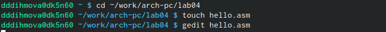{ #fig:002 width=70% }

Ввожу программу в ассемблер и сохраняю (рис. @fig:003).

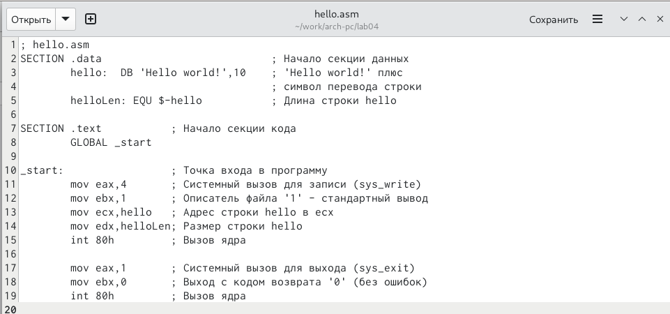{ #fig:003 width=70% }

Компилирую текст программы "Hello world" и провожу проверку правильности созданного файла с помощью команды ls (рис. @fig:004).

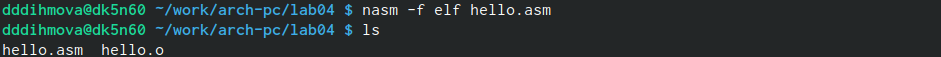{ #fig:004 width=70% }

Я компилирую исходный файл hello.asm в obj.o (рис. @fig:005).

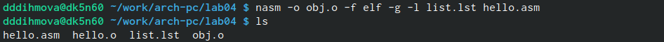{ #fig:005 width=70% }

Передаю объектный файл на обработку компоновщику и делаю проверку (рис. @fig:006).

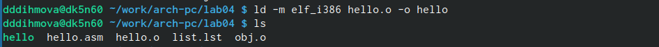{ #fig:006 width=70% }

Ввожу команду согласно лабораторной работе. Исполняемый файл имеет имя main, а объектный файл - odj.o (рис. @fig:007).

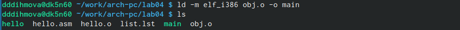{ #fig:007 width=70% }

Запускаю исполняемый файл hello (рис. @fig:008).

{ #fig:008 width=70% }

Мне захотелось увидеть формат командной строки LD. Для этого я ввела команду ld --help (рис. @fig:009).

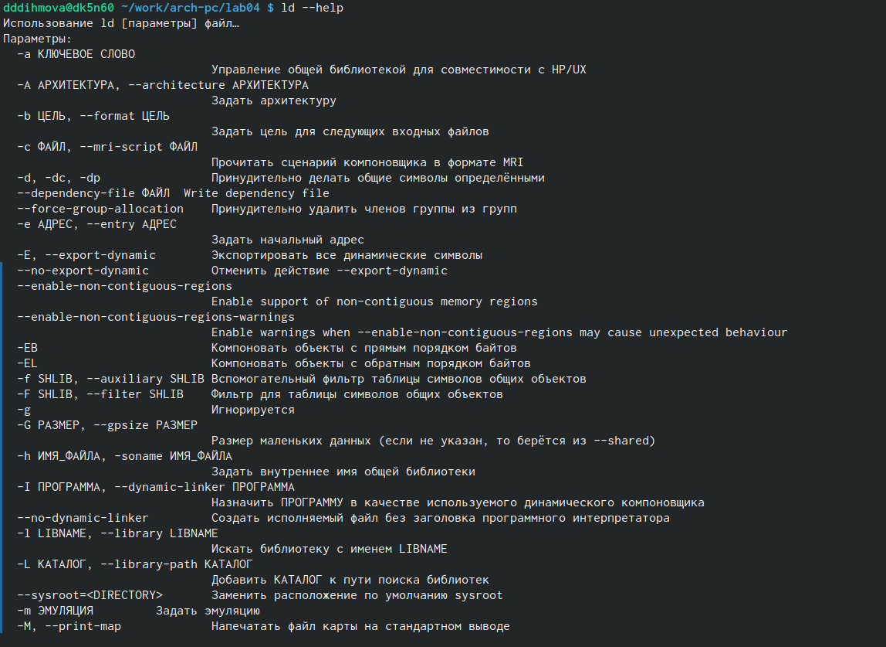{ #fig:009 width=70% }
 
Запускаю на выполнение созданный исполняемый файл (рис. @fig:0010).
 
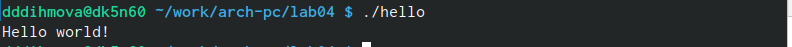{ #fig:0010 width=70% }

# Выполнение заданий для самостоятельной работы

Я создаю копию файла с помощью команды cp (рис. @fig:0011).

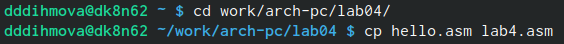{ #fig:0011 width=70% }

С помощью текстового редактора gedit вношу изменения в текст программы lab4.asm (рис. @fig:0012).
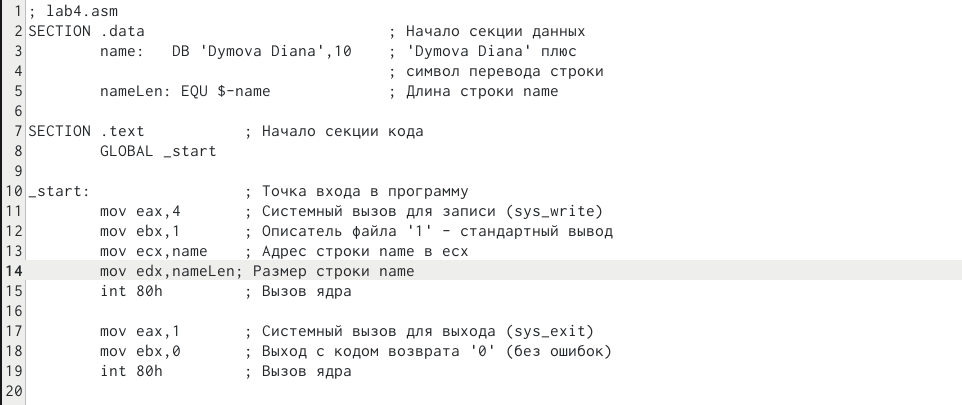{ #fig:0012 width=70% }

Проверяю корректность изменений в файле lab4.asm, так чтобы при вводе команды ./name выводилось моё имя. Также транслирую полученный текст программы в объектный файл и выполняю компановку объектного файла, запускаю получившийся исполняемый файл (рис. @fig:0013).

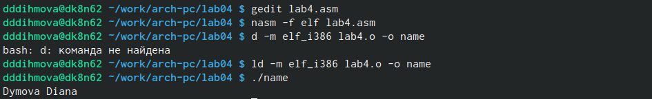{ #fig:0013 width=70% }

Я копирую файлы hello.asm и lab4.asm в локальный репозиторий в ката-
лог ~/work/study/2023-2024/"Архитектура компьютера"/arch-pc/labs/lab04/ (рис. @fig:0014).

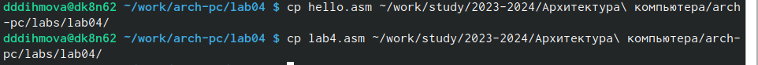{ #fig:0014 width=70% }

Загружаю данные на github (рис. @fig:0015).

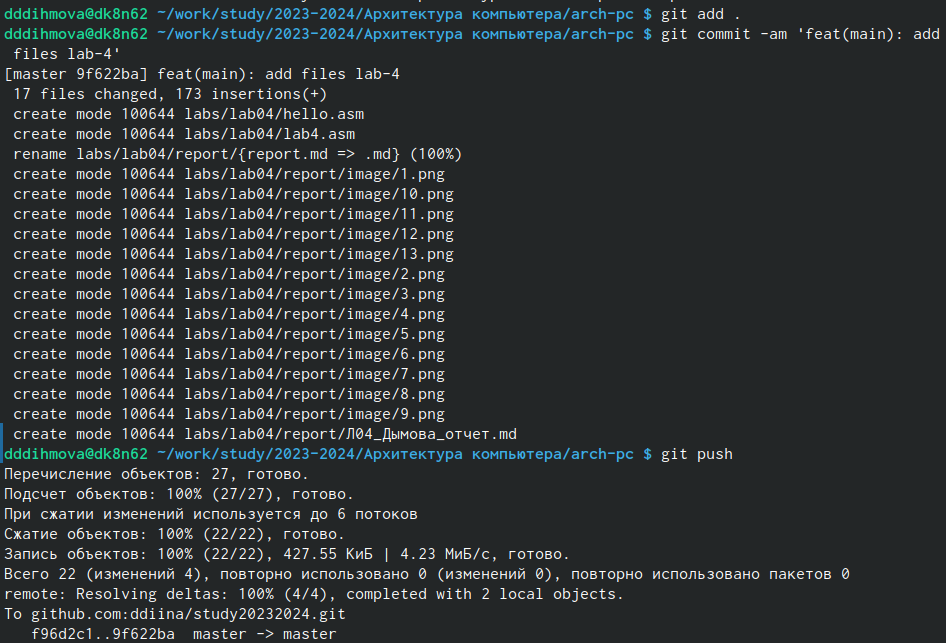{ #fig:0015 width=70% }

# Выводы

Я освоила процедуры компиляции и сборки программ, написанных на ассемблере NASM.
