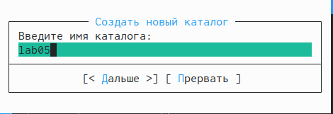
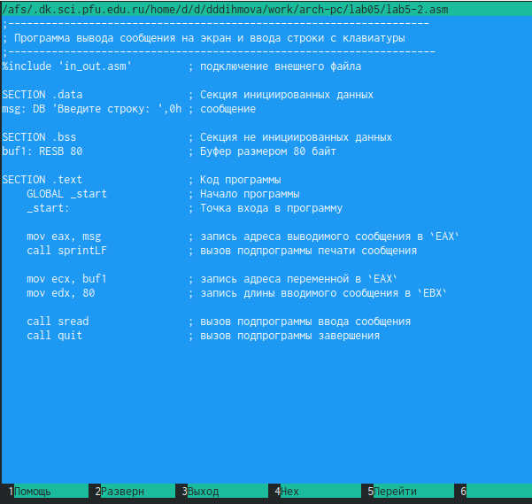
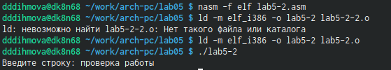

---
## Front matter
title: "Отчёт по лабораторной работе №5"
subtitle: "Дисциплина: Комьютерные технологии и технологии программирования"
author: "Дымовой Д.Д."

## Generic otions
lang: ru-RU
toc-title: "Содержание"

## Bibliography
bibliography: bib/cite.bib
csl: pandoc/csl/gost-r-7-0-5-2008-numeric.csl

## Pdf output format
toc: true # Table of contents
toc-depth: 2
lof: true # List of figures
lot: true # List of tables
fontsize: 12pt
linestretch: 1.5
papersize: a4
documentclass: scrreprt
## I18n polyglossia
polyglossia-lang:
  name: russian
  options:
	- spelling=modern
	- babelshorthands=true
polyglossia-otherlangs:
  name: english
## I18n babel
babel-lang: russian
babel-otherlangs: english
## Fonts
mainfont: PT Serif
romanfont: PT Serif
sansfont: PT Sans
monofont: PT Mono
mainfontoptions: Ligatures=TeX
romanfontoptions: Ligatures=TeX
sansfontoptions: Ligatures=TeX,Scale=MatchLowercase
monofontoptions: Scale=MatchLowercase,Scale=0.9
## Biblatex
biblatex: true
biblio-style: "gost-numeric"
biblatexoptions:
  - parentracker=true
  - backend=biber
  - hyperref=auto
  - language=auto
  - autolang=other*
  - citestyle=gost-numeric
## Pandoc-crossref LaTeX customization
figureTitle: "Рис."
tableTitle: "Таблица"
listingTitle: "Листинг"
lofTitle: "Список иллюстраций"
lotTitle: "Список таблиц"
lolTitle: "Листинги"
## Misc options
indent: true
header-includes:
  - \usepackage{indentfirst}
  - \usepackage{float} # keep figures where there are in the text
  - \floatplacement{figure}{H} # keep figures where there are in the text
---

# Цель работы

Приобретение практических навыков работы в Midnight Commander. Освоение инструкций
языка ассемблера mov и int.

# Теоретическое введение

Midnight Commander (или просто mc) — это программа, которая позволяет просматривать
структуру каталогов и выполнять основные операции по управлению файловой системой,
т.е. mc является файловым менеджером. Midnight Commander позволяет сделать работу с
файлами более удобной и наглядной.

С помощью клавиш F1-F10 можно выполнять действия в командере.

Программа на языке ассемблера NASM, как правило, состоит из трёх секций: секция кода
программы (SECTION .text), секция инициированных (известных во время компиляции)
данных (SECTION .data) и секция неинициализированных данных (тех, под которые во
время компиляции только отводится память, а значение присваивается в ходе выполнения
программы) (SECTION .bss).

# Выполнение лабораторной работы

Я открыла Midnight Commander (рис. @fig:001).

{#fig:001 width=70%}

Перемещение по каталогам через Midnight Commander (рис. @fig:002).

{#fig:002 width=70%}

Создаю папку lab05 (рис. @fig:003).

{#fig:003 width=70%}

С помощью команды touch создаю файл lab5-1.asm (рис. @fig:004).

{#fig:004 width=70%}

Я ввожу текст программы из листинга в файл lab5-1.asm. Использую для редактирования текстовый редактор mcedit (рис. @fig:005).

{#fig:005 width=70%}

Транслирую текст программы lab5-1.asm в объектный файл и выполняю компановку объектоного файла, запускаю получившийся исполняемый файл и ввожу своё ФИО (рис. @fig:006).

{#fig:006 width=70%}

Я скачала файл сос страницы курса в ТУИС, переместила подключаемый файл из каталога Загрузки в каталог lab05  (рис. @fig:007).

{#fig:007 width=70%}

Проверяю правильность выполнения задания (рис. @fig:008).

{#fig:008 width=70%}

Создаю копию файла lab5-1.asm с именем lab5-2.asm (рис. @fig:009).

{#fig:009 width=70%}

Ввожу в командер текст листинга 5.2 с использованием подпрограммы из внешнего файла (рис. @fig:010).

{#fig:010 width=70%}

Провожу трансляцию и компановку файла lab5-2.asm и проверяю его работу (рис. @fig:011).

{#fig:011 width=70%} 

В файле lab5-2.asm заменяю подпрограмму sprintLF на sprint и снова создаю исполняемый файл  (рис. @fig:012).

{#fig:012 width=70%}

Разница лишь в том, что вводится с клавиатуры в первом случае текст с новой строки, а во втором остается на этой же.
 
# Выполнение заданий для самостоятельной работы

Cоздаю копию файла lab5-1.asm, называю его lab5-1-2.asm  (рис. @fig:013).

{#fig:013 width=70%}

Вношу изменения в программу между системными вызовами read и exit, так чтобы она работала по алгоритму указанному на ТУИС  (рис. @fig:014).

{#fig:014 width=70%}

Получаю исполняемый файл и проверяю его работу  (рис. @fig:015).

{#fig:015 width=70%}

Cоздаю копию файла lab5-2.asm, называю его lab5-2-2.asm  (рис. @fig:016).

{#fig:016 width=70%}

Вношу изменения в программу после call sread (вызов ввода сообщения) и call quit (вызов завершения), так чтобы она работала по алгоритму указанному на ТУИС  (рис. @fig:017).

{#fig:017 width=70%}

Получаю исполняемый файл и проверяю его работу  (рис. @fig:018).

{#fig:018 width=70%}

# Выводы

Я приобрела практические навыки работы в Midnight Commander и освоила инструкции языка ассемблера mov и int.

# Список литературы{.unnumbered}

::: {#refs}
:::
