---
## Front matter

title: "Отчёт по лабораторной работе №6"
subtitle: "Дисциплина: Комьютерные технологии и технологии программирования"
author: "Дымовой Д.Д."

## Generic otions
lang: ru-RU
toc-title: "Содержание"

## Bibliography
bibliography: bib/cite.bib
csl: pandoc/csl/gost-r-7-0-5-2008-numeric.csl

## Pdf output format
toc: true # Table of contents
toc-depth: 2
lof: true # List of figures
lot: true # List of tables
fontsize: 12pt
linestretch: 1.5
papersize: a4
documentclass: scrreprt
## I18n polyglossia
polyglossia-lang:
  name: russian
  options:
	- spelling=modern
	- babelshorthands=true
polyglossia-otherlangs:
  name: english
## I18n babel
babel-lang: russian
babel-otherlangs: english
## Fonts
mainfont: PT Serif
romanfont: PT Serif
sansfont: PT Sans
monofont: PT Mono
mainfontoptions: Ligatures=TeX
romanfontoptions: Ligatures=TeX
sansfontoptions: Ligatures=TeX,Scale=MatchLowercase
monofontoptions: Scale=MatchLowercase,Scale=0.9
## Biblatex
biblatex: true
biblio-style: "gost-numeric"
biblatexoptions:
  - parentracker=true
  - backend=biber
  - hyperref=auto
  - language=auto
  - autolang=other*
  - citestyle=gost-numeric
## Pandoc-crossref LaTeX customization
figureTitle: "Рис."
tableTitle: "Таблица"
listingTitle: "Листинг"
lofTitle: "Список иллюстраций"
lotTitle: "Список таблиц"
lolTitle: "Листинги"
## Misc options
indent: true
header-includes:
  - \usepackage{indentfirst}
  - \usepackage{float} # keep figures where there are in the text
  - \floatplacement{figure}{H} # keep figures where there are in the text
---

# Цель работы

Освоение арифметических инструкций языка ассемблера NASM.

# Теоретическое введение

Адресация в NASM

Существует три основных способа адресации:
• Регистровая адресация – операнды хранятся в регистрах и в команде используются
имена этих регистров, например: mov ax,bx.
• Непосредственная адресация – значение операнда задается непосредственно в ко-
манде, Например: mov ax,2.
• Адресация памяти – операнд задает адрес в памяти. В команде указывается символи-
ческое обозначение ячейки памяти, над содержимым которой требуется выполнить
операцию.

Арифметические операции в NASM:

add <операнд_1>, <операнд_2> Целочисленное сложение
sub <операнд_1>, <операнд_2> Целочисленное вычитание

# Выполнение лабораторной работы

Я создаю каталог для программ лабораторной работы №6, перехожу в него и создаю файл lab6-1.asm (рис. @fig:001).

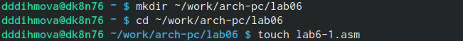{#fig:001 width=70%}

Ввожу текст программы из листинга 6.1 в файл lab6-1.asm (рис. @fig:002).

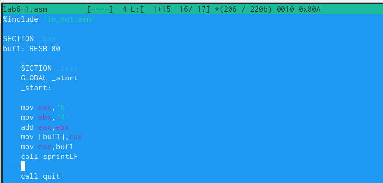{#fig:002 width=70%}

Создаю исполняемый файл и запускаю его (рис. @fig:003).

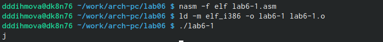{ #fig:003 width=70% }

Вношу изменения согласно заданию и ещё раз создаю исполняемый файл, запускаю его (рис. @fig:004).

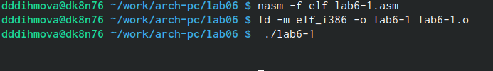{ #fig:004 width=70% }

Согласно таблице ASCII код 10 соответствует символу STX, этот символ не отображается.

Создаю с помощью команды  touch файл lab6-2.asm и ввожу текст программы из листинга 6.2 (рис. @fig:005).

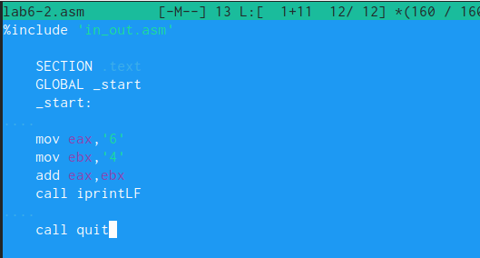{ #fig:005 width=70% }

Создаю исполняемый файл и запускаю его (рис. @fig:006).

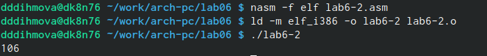{ #fig:006 width=70% }

Вношу изменения согласно заданию и ещё раз создаю исполняемый файл, запускаю его (рис. @fig:007).

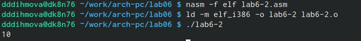{ #fig:007 width=70% }

Результат число 10.

Заменяю функцию iprintLF на iprint, снова создаю исполняемый файл и запускаю (рис. @fig:008).

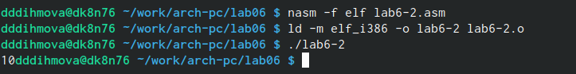{ #fig:008 width=70% }

Функции iprintLF и iprint отличаются тем, что iprint выводит в той же строке, а iprintLF переходит на новую.

Создаю файл lab6-3.asm в каталоге ~/work/arch-pc/lab06 (рис. @fig:009).

{ #fig:009 width=70% }

Ввожу текст программый из листинга 6.3 в созданный файл lab6-3.asm (рис. @fig:010).

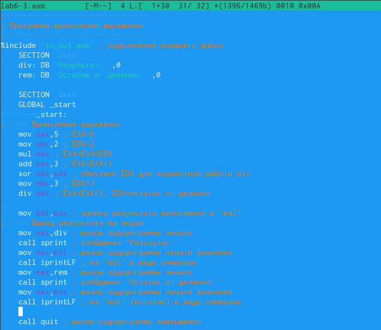{ #fig:010 width=70% }

Создаю исполняемый файл и запускаю его (рис. @fig:011).

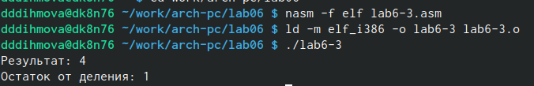{ #fig:011 width=70% }

Вношу изменения согласно заданию и ещё раз создаю исполняемый файл, запускаю его (рис. @fig:0012).

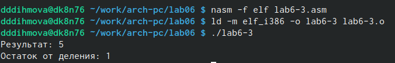{ #fig:012 width=70% }

С помощью команды touch создаю файл variant.asm (рис. @fig:013).

{ #fig:013 width=70% }

Ввожу текст программый из листинга 6.4 в созданный файл variant.asm (рис. @fig:014).

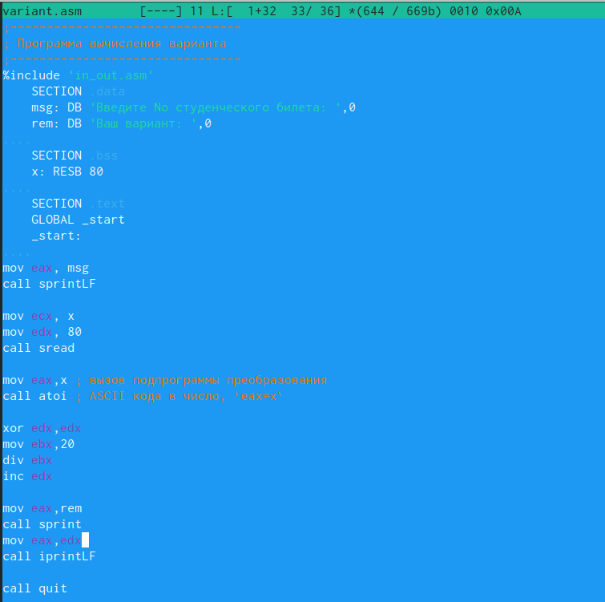{ #fig:014 width=70% }

Создаю исполняемый файл и запускаю его (рис. @fig:015).

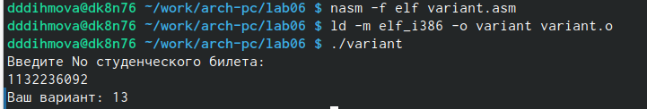{ #fig:015 width=70% }

Ответы на вопросы:

1) Сообщение ‘Ваш вариант:’ сначала задаётся переменной (rem: DB ‘Ваш вариант:’, 0), а затем выводится с помощью команд:

mov eax, msg 
call sprintLF

2) В переменную х заносится вводимый текст. Команда mov edx, 80 записывает длину вводимого сообщения, call sread отвечает за вызов подпрограммы ввода сообщения.

3) эта функция преобразует ASCII-код символа в целое число и записывает результат
в регистр eax.

4)
Переменной msg задаётся номер студенческого. А переменной rem полученный вариант.

msg: DB 'Введите No студенческого билета: ',0
rem: DB 'Ваш вариант: ',0

Далее call sprintLF выводит сообщение 'Введите No студенческого билета: ' на экран, производится ввод с клавиатуры. Вызывается подпрограмма (call sread) отвечающая за ввод сообщения. 

Далее обнуляется edx для корректной работы div:

xor edx,edx
mov ebx,20
div ebx
inc edx

В edx записывается результат.

Далее вызывается с помощью подпрограммы переменная rem и выводится посчитанный ответ.

mov eax,rem
call sprint
mov eax,edx
call iprintLF

Завершенние работы программы. 

call quit

5) В регистр edx

6) Это команда инкремента, она увеличивает значение регистра на 1.

7)Результат вычислений:
mov eax,rem
call sprint
mov eax,edx
call iprintLF
# Задание для самостоятельной работы

Я написала программу для вычисления выражения из 13 варианта (рис. @fig:016).

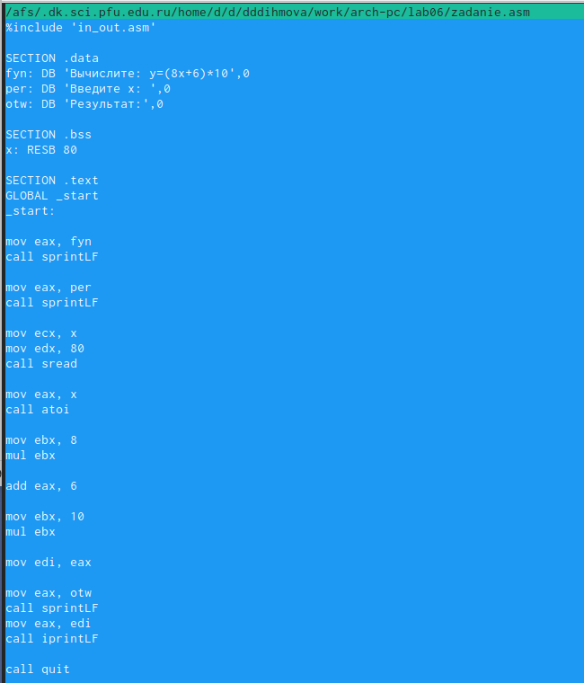{ #fig:016 width=70% }

Делаю компановку и трансляцию, провожу проверку работы программы для х=1 и х=4(рис. @fig:017).
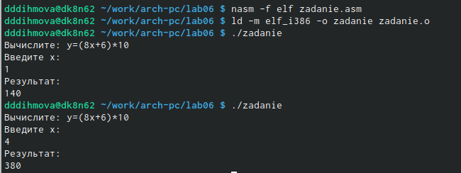{ #fig:017 width=70% }

# Выводы

Я освоила арифметические инструкции языка ассемблера NASM.

# Список литературы{.unnumbered}

::: {#refs}
:::
