---
## Front matter
title: "Отчёт по лабораторной работе №7"
subtitle: "Дисциплина: Комьютерные технологии и технологии программирования"
author: "Дымовой Д.Д."

## Generic otions
lang: ru-RU
toc-title: "Содержание"

## Bibliography
bibliography: bib/cite.bib
csl: pandoc/csl/gost-r-7-0-5-2008-numeric.csl

## Pdf output format
toc: true # Table of contents
toc-depth: 2
lof: true # List of figures
lot: true # List of tables
fontsize: 12pt
linestretch: 1.5
papersize: a4
documentclass: scrreprt
## I18n polyglossia
polyglossia-lang:
  name: russian
  options:
	- spelling=modern
	- babelshorthands=true
polyglossia-otherlangs:
  name: english
## I18n babel
babel-lang: russian
babel-otherlangs: english
## Fonts
mainfont: PT Serif
romanfont: PT Serif
sansfont: PT Sans
monofont: PT Mono
mainfontoptions: Ligatures=TeX
romanfontoptions: Ligatures=TeX
sansfontoptions: Ligatures=TeX,Scale=MatchLowercase
monofontoptions: Scale=MatchLowercase,Scale=0.9
## Biblatex
biblatex: true
biblio-style: "gost-numeric"
biblatexoptions:
  - parentracker=true
  - backend=biber
  - hyperref=auto
  - language=auto
  - autolang=other*
  - citestyle=gost-numeric
## Pandoc-crossref LaTeX customization
figureTitle: "Рис."
tableTitle: "Таблица"
listingTitle: "Листинг"
lofTitle: "Список иллюстраций"
lotTitle: "Список таблиц"
lolTitle: "Листинги"
## Misc options
indent: true
header-includes:
  - \usepackage{indentfirst}
  - \usepackage{float} # keep figures where there are in the text
  - \floatplacement{figure}{H} # keep figures where there are in the text
---

# Цель работы

Изучение команд условного и безусловного переходов. Приобретение навыков написания программ с использованием переходов. Знакомство с назначением и структурой файла листинга.

# Теоретическое введение

Для реализации ветвлений в ассемблере используются так называемые команды передачи управления или команды перехода. Можно выделить 2 типа переходов:
1) условный переход – выполнение или не выполнение перехода в определенную точку
программы в зависимости от проверки условия.
2) безусловный переход – выполнение передачи управления в определенную точку про-
граммы без каких-либо условий.

# Выполнение лабораторной работы

Создаю каталог для программ лабораторной работы №7, перехожу в него и создаю файл lab7-1.asm (рис. @fig:001).

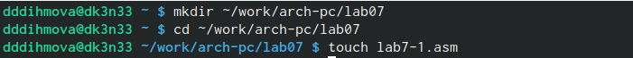{#fig:001 width=70%}

Ввожу текст программы листинга 7.1 (рис. @fig:002).

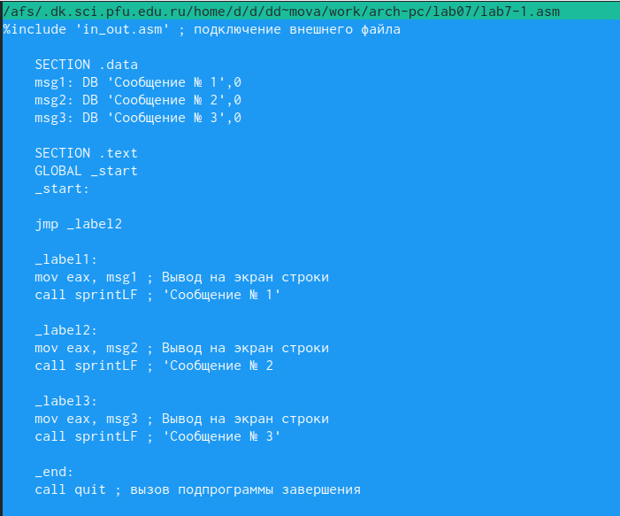{#fig:002 width=70%}

Создаю исполняемый файл и запускаю его (рис. @fig:003).

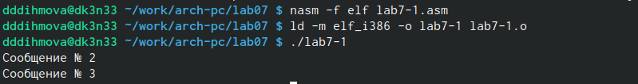{#fig:003 width=70%}

Ввожу текст программы листинга 7.2 (рис. @fig:004).

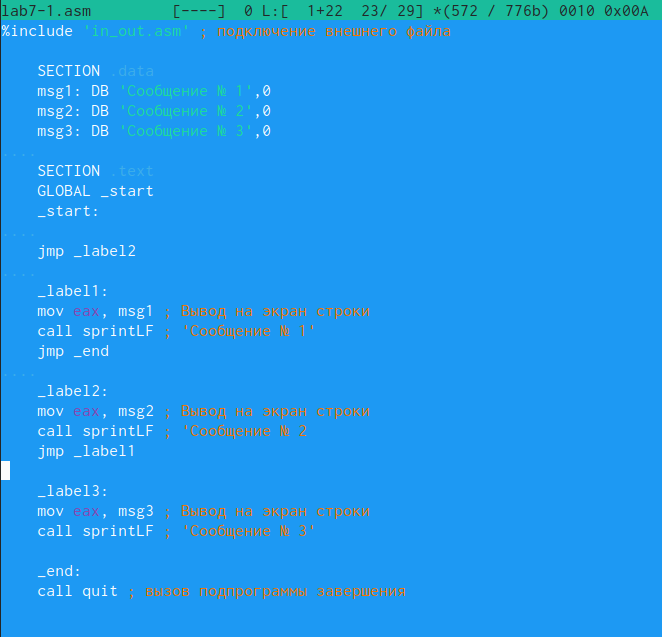{#fig:004 width=70%}

Создаю исполняемый файл и запускаю его (рис. @fig:005).

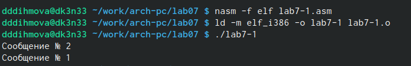{#fig:005 width=70%}

Изменяю программы согласно условиям задачи (рис. @fig:006).

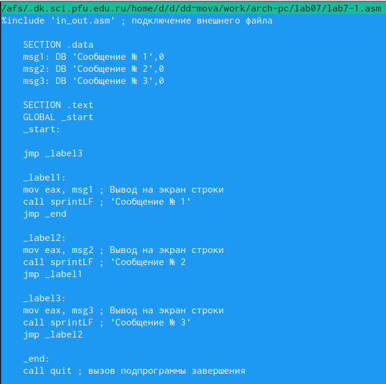{#fig:006 width=70%}

Создаю исполняемый файли запускаю его (рис. @fig:007).

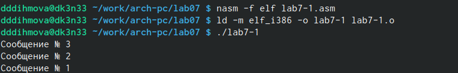{#fig:007 width=70%}

Создаю с помощью команды touch файл lab7-2.asm (рис. @fig:008).

{#fig:008 width=70%}

Ввожу текст программы листинга 7.3 (рис. @fig:009).

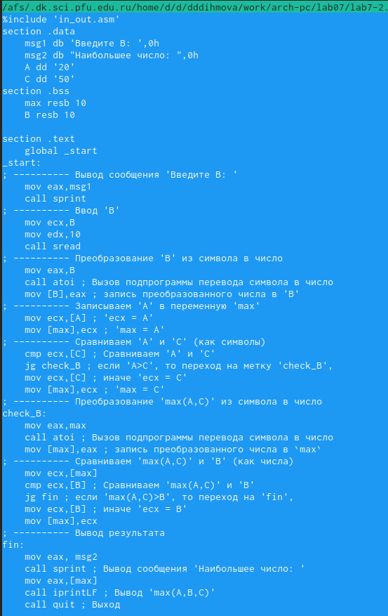{#fig:009 width=70%}

Создаю исполняемый файли запускаю его, проверяю работу программы на различных числах (рис. @fig:010).

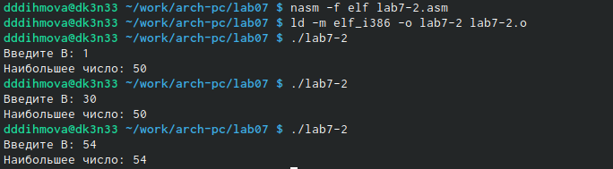{#fig:010 width=70%}

Получаю файл листинга, открываю его (рис. @fig:0011).

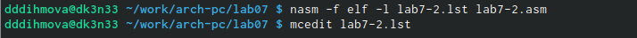{#fig:011 width=70%}

Я попробую объснить этот фрагмент программы (рис. @fig:012).

{#fig:012 width=70%}

Первая цифра это номер строки, далее идёт адрес, а затем машинный код в 16-ричной последовательности, после этого исходный текст программы.

В моём фрагменте:
14 - номер строки, 0000000В - адрес, 29D8 - машинный код программы sub eax, ebx.

15 - номер строки, 0000000D - адрес, 5В - машинный код программы pop ebx.

16 - номер строки, 0000000Е - адрес, С3 - машинный код программы ret.

В данном фрагменте (mov [max], eax) удаляю eax (рис. @fig:013).

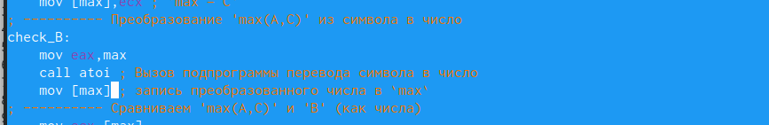{#fig:013 width=70%}

Выполняю трансляцию с получением файла листинга (рис. @fig:014).

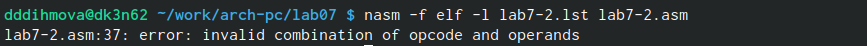{#fig:014 width=70%}

Выходным файлом будет толкьо файл с листингом. В листинге добавляется сообщение об ошибке (рис. @fig:015).

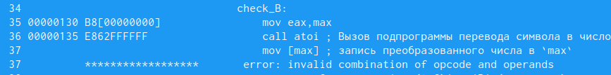{#fig:015 width=70%}

#Задание для самостоятельной работы

Пишу программу согласно условиям 13 варианта (рис. @fig:017).

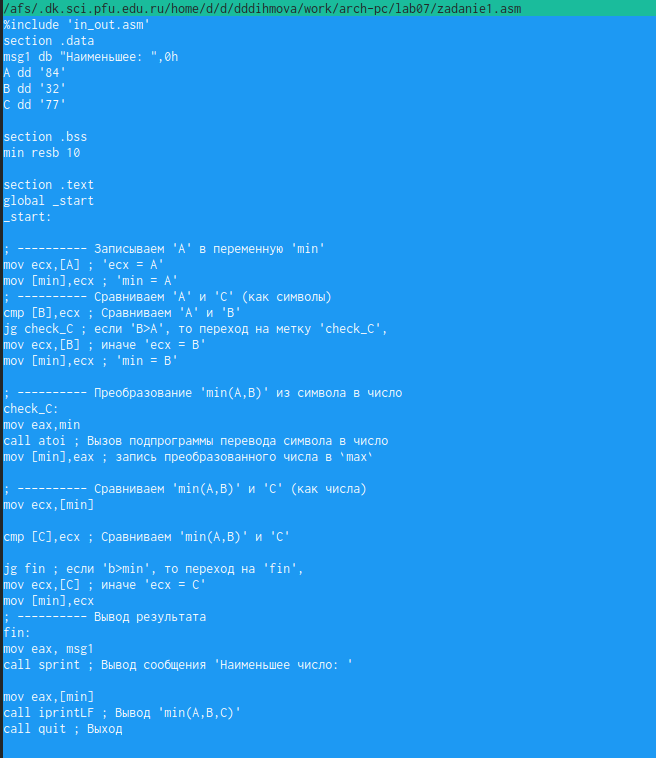{#fig:017 width=70%}

Создаю исполняемый файл и запускаю его (рис. @fig:016).

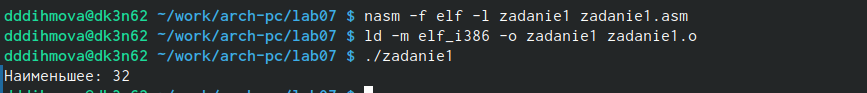{#fig:016 width=70%}

Пишу программу согласно условиям 13 варианта (рис. @fig:022).

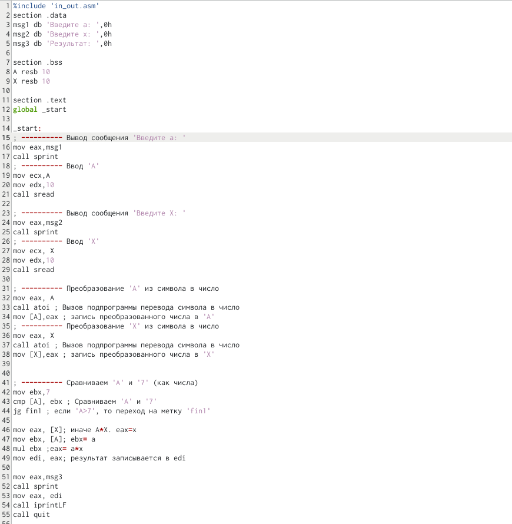{#fig:022 width=70%}

Продолжение программы (рис. @fig:023).

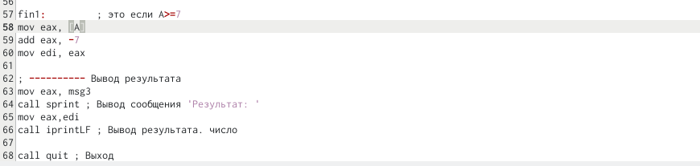{#fig:023 width=70%}

Создаю исполняемый файл и запускаю его с указанными значениями х и а (рис. @fig:018).

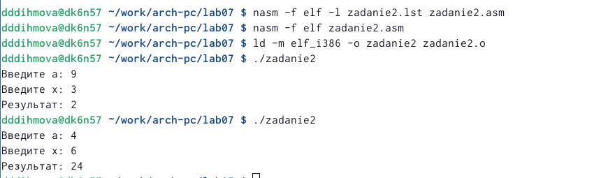{#fig:018 width=70%}

Сохраняю все данные и отправляю результаты на git hub.

# Выводы

Я изучила команды условного и безусловного переходов. Приобрела навыки написания программ с использованием переходов. Познакомилась с назначением и структурой файла листинга.

# Список литературы{.unnumbered}

::: {#refs}
:::
