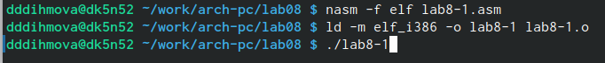
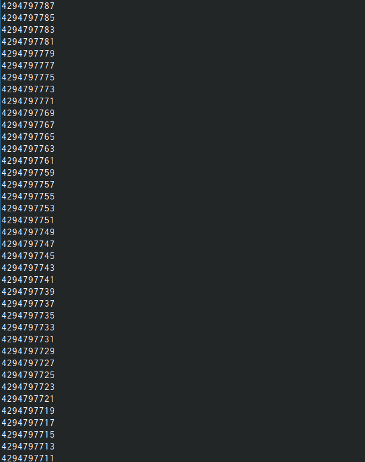
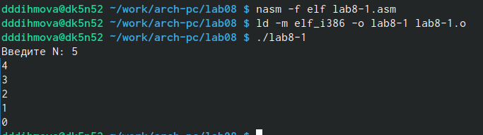
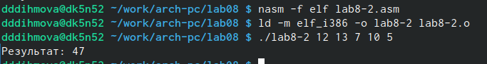
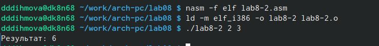
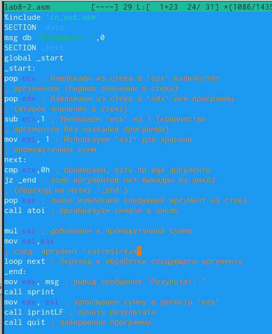
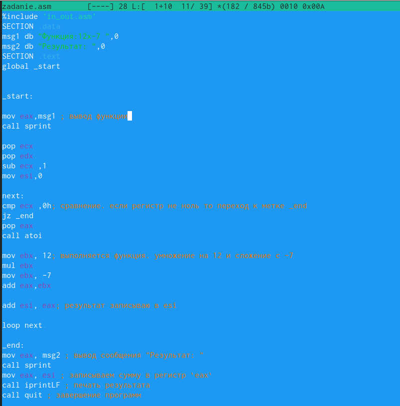
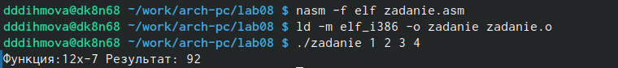

---
## Front matter
title: "Отчёт по лабораторной работе №8"
subtitle: "Дисциплина: Комьютерные технологии и технологии программирования"
author: "Дымовой Д.Д."

## Generic otions
lang: ru-RU
toc-title: "Содержание"

## Bibliography
bibliography: bib/cite.bib
csl: pandoc/csl/gost-r-7-0-5-2008-numeric.csl

## Pdf output format
toc: true # Table of contents
toc-depth: 2
lof: true # List of figures
lot: true # List of tables
fontsize: 12pt
linestretch: 1.5
papersize: a4
documentclass: scrreprt
## I18n polyglossia
polyglossia-lang:
  name: russian
  options:
	- spelling=modern
	- babelshorthands=true
polyglossia-otherlangs:
  name: english
## I18n babel
babel-lang: russian
babel-otherlangs: english
## Fonts
mainfont: PT Serif
romanfont: PT Serif
sansfont: PT Sans
monofont: PT Mono
mainfontoptions: Ligatures=TeX
romanfontoptions: Ligatures=TeX
sansfontoptions: Ligatures=TeX,Scale=MatchLowercase
monofontoptions: Scale=MatchLowercase,Scale=0.9
## Biblatex
biblatex: true
biblio-style: "gost-numeric"
biblatexoptions:
  - parentracker=true
  - backend=biber
  - hyperref=auto
  - language=auto
  - autolang=other*
  - citestyle=gost-numeric
## Pandoc-crossref LaTeX customization
figureTitle: "Рис."
tableTitle: "Таблица"
listingTitle: "Листинг"
lofTitle: "Список иллюстраций"
lotTitle: "Список таблиц"
lolTitle: "Листинги"
## Misc options
indent: true
header-includes:
  - \usepackage{indentfirst}
  - \usepackage{float} # keep figures where there are in the text
  - \floatplacement{figure}{H} # keep figures where there are in the text
---

# Цель работы

Приобретение навыков написания программ с использованием циклов и обработкой аргументов командной строки.

# Теоретическое введение

Стек — это структура данных, организованная по принципу LIFO («Last In — First Out»
или «последним пришёл — первым ушёл»). Стек является частью архитектуры процессора и
реализован на аппаратном уровне. Для работы со стеком в процессоре есть специальные
регистры (ss, bp, sp) и команды.

push -10 	; Поместить -10 в стек
push ebx 	; Поместить значение регистра ebx в стек
push [buf] 	; Поместить значение переменной buf в стек
push word [ax] 	; Поместить в стек слово по адресу в ax

Существует ещё две команды для добавления значений в стек. Это команда pusha, которая
помещает в стек содержимое всех регистров общего назначения в следующем порядке: ах,
сх, dx, bх, sp, bp, si, di. А также команда pushf, которая служит для перемещения в стек
содержимого регистра флагов. Обе эти команды не имеют операндов.

pop eax 	; Поместить значение из стека в регистр eax
pop [buf] 	; Поместить значение из стека в buf
pop word[si] 	; Поместить значение из стека в слово по адресу в si.

# Выполнение лабораторной работы

Я создаю каталог lab08 в директории ~/work/arch-pc/. Ввожу текст программы листинга, создаю исполняемый файл и запускаю его. Этот цикл выводит числа от 5 до 0 (рис. @fig:001).

{#fig:001 width=70%}

Вношу изменения согласно условиям лабораторной работы, создаю исполняемый файл и запускаю его (рис. @fig:002).

{#fig:002 width=70%}

Фрагмент программы выводимой при вводе с клавиатуры N=5 (рис. @fig:003).

{#fig:003 width=70%}

Значения регистр ecx принимает [N], введенные с клавиатуры, но число проходов цикла не заканчивается. 

Снова вношу изменения согласно условиям, создаю исполныемый файл и запускаю его (рис. @fig:004).

{#fig:004 width=70%}

Да, в этом случае соответсвует.

Создаю файл в каталоге, ввожу в него текст программы листинга 8.2, создаю исполняемый файл и запускаю его, указав аргументы (рис. @fig:005).

{#fig:005 width=70%}

Изменяю программу, чтобы вместо суммы выводилось произведение аргументов (рис. @fig:008).

{#fig:008 width=70%}

add меняю на mul и сохраняю промежуточные суммы (mov esi,eax). А также изчально задаю esi значение 1, чтобы при умножении аргументов не умножалось на 0. 

{#fig:009 width=70%}

# Задание для самостоятельной работы

Создаю файл zadanie.asm в каталоге ~/work/arch-pc/lab08, пишу программу согласно условиям задачи и функции из 13 варианта (рис. @fig:006).

{#fig:006 width=70%}

Создаю исполняемый файл и запускаю его (рис. @fig:007).

{#fig:007 width=70%}

# Выводы

Я приобрела навыки написания программ с использованием циклов и обработкой аргументов командной строки.

# Список литературы{.unnumbered}

::: {#refs}
:::
