---
## Front matter
title: "Отчёт по лабораторной работе №8"
subtitle: "Дисциплина: Комьютерные технологии и технологии программирования"
author: "Дымовой Д.Д."

## Generic otions
lang: ru-RU
toc-title: "Содержание"

## Bibliography
bibliography: bib/cite.bib
csl: pandoc/csl/gost-r-7-0-5-2008-numeric.csl

## Pdf output format
toc: true # Table of contents
toc-depth: 2
lof: true # List of figures
lot: true # List of tables
fontsize: 12pt
linestretch: 1.5
papersize: a4
documentclass: scrreprt
## I18n polyglossia
polyglossia-lang:
  name: russian
  options:
	- spelling=modern
	- babelshorthands=true
polyglossia-otherlangs:
  name: english
## I18n babel
babel-lang: russian
babel-otherlangs: english
## Fonts
mainfont: PT Serif
romanfont: PT Serif
sansfont: PT Sans
monofont: PT Mono
mainfontoptions: Ligatures=TeX
romanfontoptions: Ligatures=TeX
sansfontoptions: Ligatures=TeX,Scale=MatchLowercase
monofontoptions: Scale=MatchLowercase,Scale=0.9
## Biblatex
biblatex: true
biblio-style: "gost-numeric"
biblatexoptions:
  - parentracker=true
  - backend=biber
  - hyperref=auto
  - language=auto
  - autolang=other*
  - citestyle=gost-numeric
## Pandoc-crossref LaTeX customization
figureTitle: "Рис."
tableTitle: "Таблица"
listingTitle: "Листинг"
lofTitle: "Список иллюстраций"
lotTitle: "Список таблиц"
lolTitle: "Листинги"
## Misc options
indent: true
header-includes:
  - \usepackage{indentfirst}
  - \usepackage{float} # keep figures where there are in the text
  - \floatplacement{figure}{H} # keep figures where there are in the text
---

# Цель работы

Приобретение навыков написания программ с использованием подпрограмм. Знакомство с методами отладки при помощи GDB и его основными возможностями.

# Теоретическое введение

Отладка — это процесс поиска и исправления ошибок в программе. В общем случае его
можно разделить на четыре этапа:
• обнаружение ошибки;
• поиск её местонахождения;
• определение причины ошибки;
• исправление ошибки.
Можно выделить следующие типы ошибок:
• синтаксические ошибки — обнаруживаются во время трансляции исходного кода и
вызваны нарушением ожидаемой формы или структуры языка;
• семантические ошибки — являются логическими и приводят к тому, что программа
запускается, отрабатывает, но не даёт желаемого результата;
• ошибки в процессе выполнения — не обнаруживаются при трансляции и вызывают пре-
рывание выполнения программы (например, это ошибки, связанные с переполнением
или делением на ноль).

Наиболее часто применяют следующие методы отладки:
• создание точек контроля значений на входе и выходе участка программы (например,
вывод промежуточных значений на экран — так называемые диагностические сообще-
ния);
• использование специальных программ-отладчиков.

# Выполнение лабораторной работы

Создаю каталог для выполнения лабораторной работы №9, перехожу в него, создаю ассемблеровский файл для работы (рис. @fig:001).

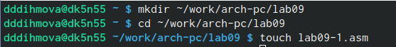{#fig:001 width=70%}

Копирую текст листинга 9.1, создаю исполняемый файл и запускаю его (рис. @fig:002).

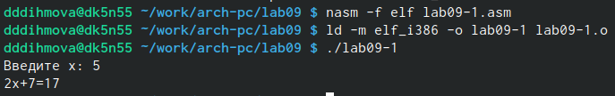{#fig:002 width=70%}

Изменяю текст программы листинга 9.1, чтобы программа работала так, как указано в условии лабораторной работы (рис. @fig:003).

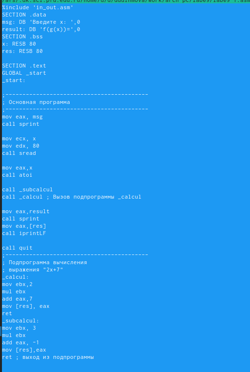{#fig:003 width=70%}

Создаю исполняемый файл и запускаю его (рис. @fig:004).

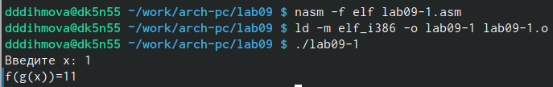{#fig:004 width=70%}

Создаю файл lab09-2.asm, вставляю туда текст программы листинга 9.2, сохраняю, создаю исполняемый файл и запускаю его (рис. @fig:005).

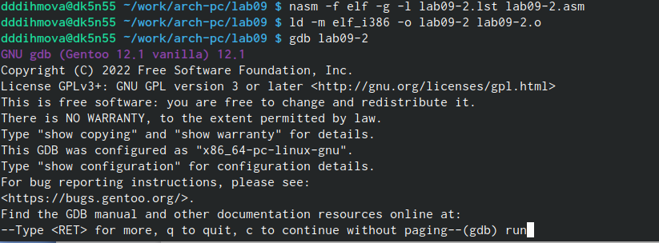{#fig:005 width=70%}

Запускаю файл в оболочке GDB (рис. @fig:006).

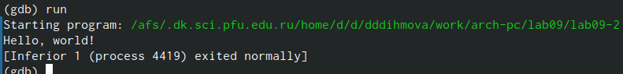{#fig:006 width=70%}

Устанавливаю брейкпоинт на метку _start (рис. @fig:007).

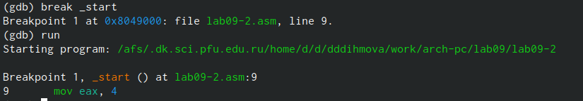{#fig:007 width=70%}

Просматриваю дисассимилированный код программы начиная с метки (рис. @fig:008).

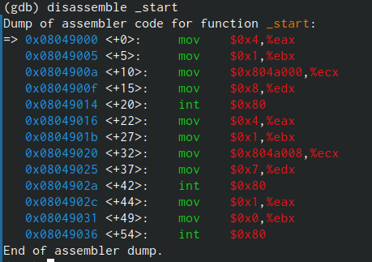{#fig:008 width=70%}

Переключаюсь на отображение команд с Intel’овским синтаксисом, введя команду set disassembly-flavor intel (рис. @fig:009).

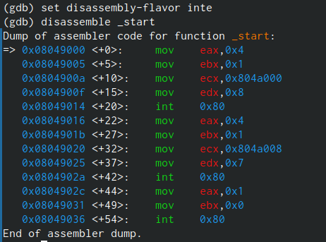{#fig:009 width=70%}

ПЕРЕЧИСЛИТЬ РАЗЛИЧИЯ ОТОБРАЖЕНИЯ СИНТАКСИСА 

Включаю режим псевдографики для более удобного анализа программы (рис. @fig:010).

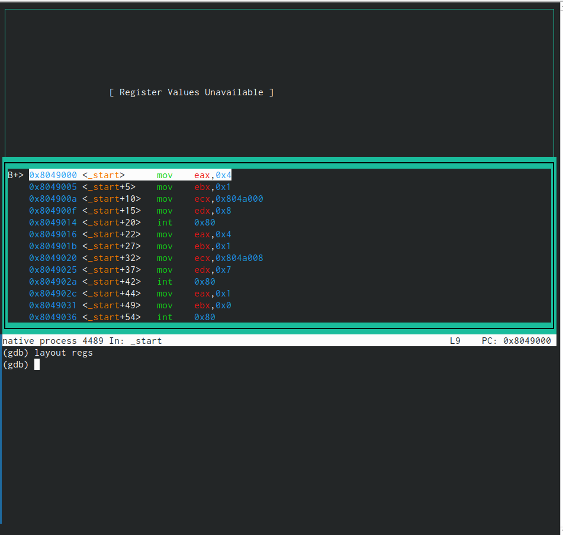{#fig:010 width=70%}

Просмотр точек брейкпоинта (рис. @fig:011).

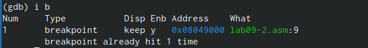{#fig:011 width=70%}

Устанавливаю брейкпоинт на инструкцию mov ebx, 0x0 (рис. @fig:012).

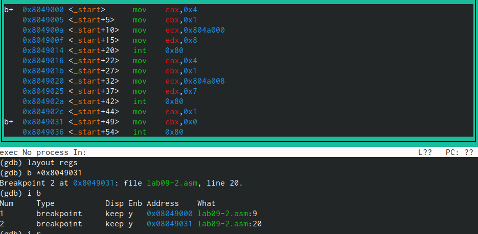{#fig:012 width=70%}

Информация о всех точках останова (рис. @fig:013).

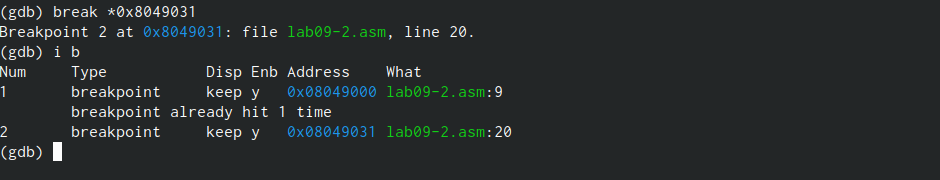{#fig:013 width=70%}

Просматриваю содержимое регистров с помощью команды i r (рис. @fig:014).

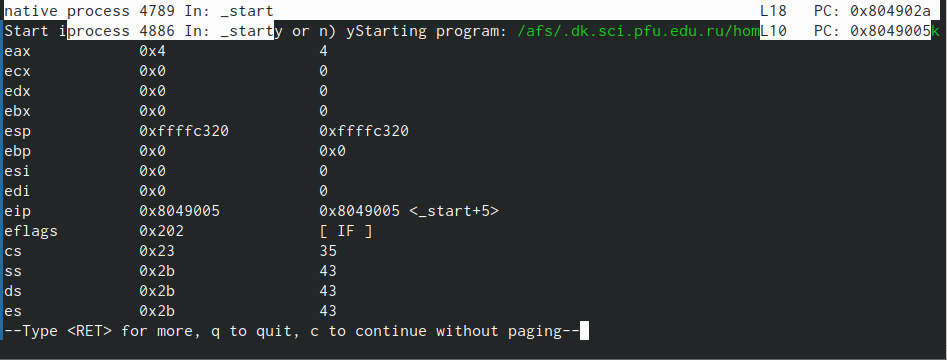{#fig:014 width=70%}

Смотрю значение переменной msg1 (рис. @fig:015).

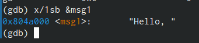{#fig:015 width=70%}

Заменяю значение переменной msg1 (рис. @fig:016).

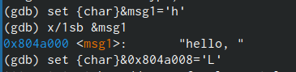{#fig:016 width=70%}

Просматриваю значение аргумента msg2. 0x804a008 адрес msg2 (рис. @fig:017).

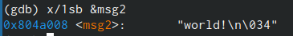{#fig:017 width=70%}

Просматриваю значение регистра ebx в разных форматах (рис. @fig:018).

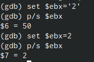{#fig:018 width=70%}

Завершаю выполнение программы с помощью команды q (рис. @fig:019).

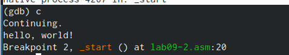{#fig:019 width=70%}

Выхожу из gdb с помощью команды q (рис. @fig:020).

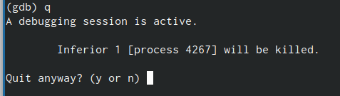{#fig:020 width=70%}

Я копирую файл lab8-2.asm в папку с лабораторной номер 9 и называю его lab09-2.asm, создаю исполняемый файл и запускаю его через gdb. Эта программы должна находить произведение аргументов. Также я ставлю точку останова на месту старт (рис. @fig:021).

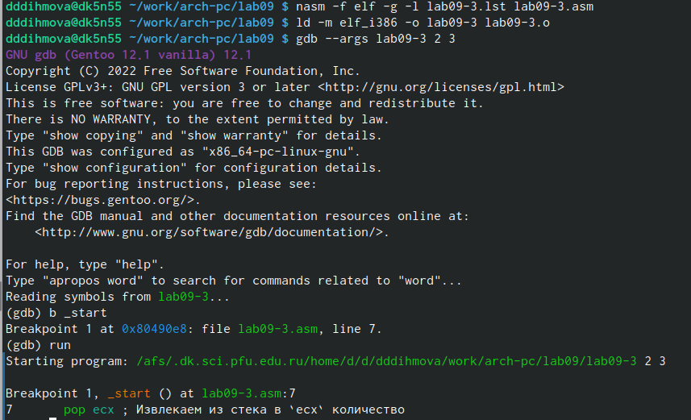{#fig:021 width=70%}

Рассматриваю позиции стека, так как у меня всего два аргумента на шаге ( +16) выдаёт ошибку (рис. @fig:022).

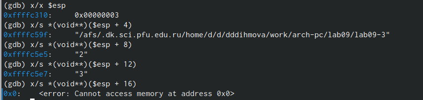{#fig:022 width=70%}

# Задание для самостоятельной работы

Создаю файл zadanie1.asm для выполнения первого задания из самостоятельной работы. Ввожу текст программы листинга 9.1 для удобства. Пишу программу согласно 13 варианту лабораторной работы номер 8 (рис. @fig:023).

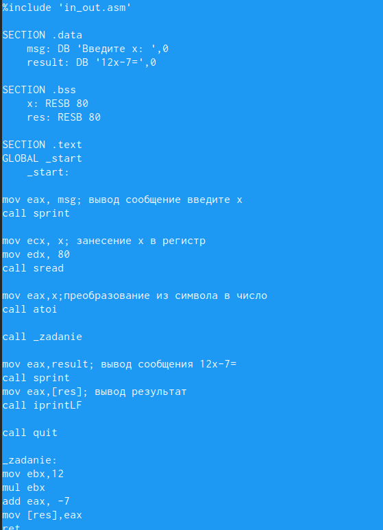{#fig:023 width=70%}

Создаю исполняемый файл и запускаю его (рис. @fig:024).

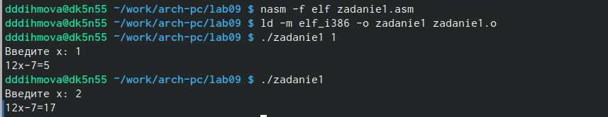{#fig:024 width=70%}

Создаю файл zadanie2.asm для выполнения второго пункта лабораторной работы, ввожу туда текст листинга 9.3, сохраняю, создаю исполняемый файл и запускаю его. Убеждаюсь, что результат неверный. Ответ должен быть 25 (рис. @fig:025).

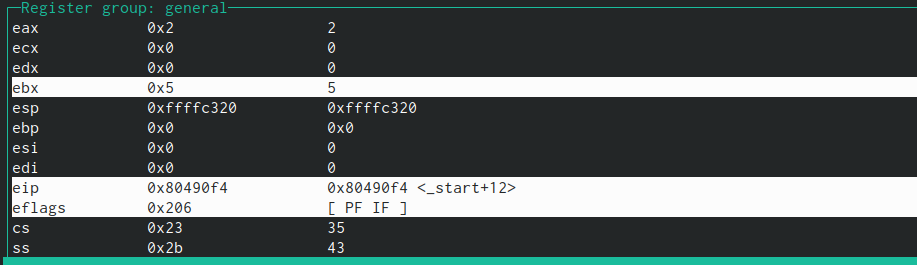{#fig:025 width=70%}

Запускаю откладчик, смотрю как изменяется регистры eax, ebx, ecx пошагово с помощью команды si. Замечаю, что на третьем шаге регистр ebx имеет значение 5, а на четвертом шаге ecx и eax перемножаются, что и дает неверный результат. Следовательно изменяю программу так, чтобы результат сложения записывался в eax (рис. @fig:025).

{#fig:025 width=70%}

У меня снова вывелся неправильный результат, пошагово проверяю как изменяются регистры, замечаю что в следующем сложении 5 прибавляется к регистру ebx, а должно к регистру eax, и в конце результат edi записывается в ebx, а должен в eax, изменяю и эту строчку (рис. @fig:026).

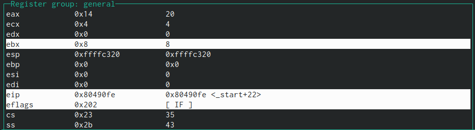{#fig:026 width=70%}

Создаю исполняемый файл и запускаю его (рис. @fig:027).

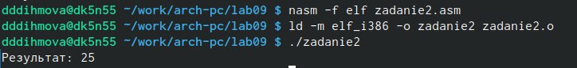{#fig:027 width=70%}

Текст моей программы (рис. @fig:028).

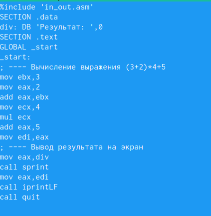{#fig:028 width=70%}

# Выводы

Я приобрела навыки написания программ с использованием подпрограмм. Познакомилась с методами отладки при помощи GDB и его основными возможностями.

# Список литературы{.unnumbered}

::: {#refs}
:::
